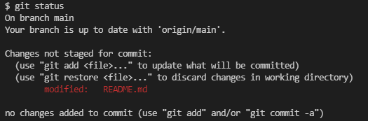
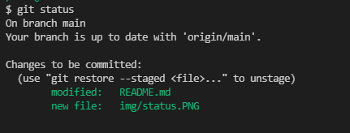

# GitHub

## Comandos basicos de github

* Clonar repositorio
	git clone url del repo

* Estado de nuestros archivos, archivos y la rama
	git status  
	

* Añadir cambios.
	git add .  
	

* Guardar un commit
git commit -m "regañona de Paola"

* Subir cambios
	git pull origin main

* Podemos ver la informacion de los commit
	git log
* Lady Paola se puso de malgenio

* para resetiar un commit que hayamos hecho
	git reset --hard HEAD~1

* git reset --mixed 

* git merge --abort

HOLAAAA, has manejado muy bien los comandos

*La clase con la profe Paola super  procdutiva la voy a recomendar :)

* git checkout --- para cambiar de ramas y se agrega el nombre de la rama al final